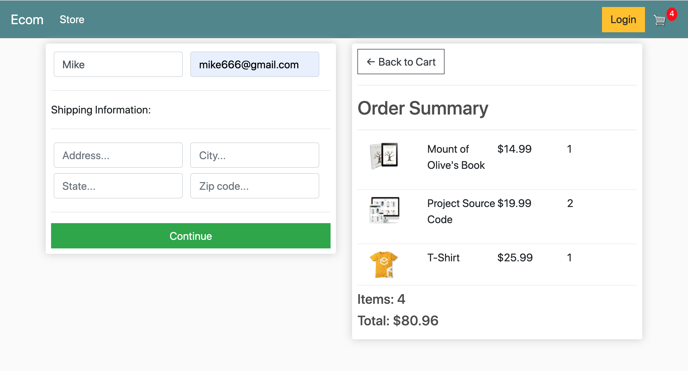

# django_ecommerce

# Project Title

Ecommerce

## Description

Store page


Cart page


Users login checkout page
Hide user basic information that users don't input their information again.


Users non-login checkout page


Integrate Paypal API


## Getting Started

### Dependencies

* css bootstrap

### Installing

* pip install django
* pip install pillow

### Executing program

* How to run the program
* Step-by-step bullets
```
    $ cd django_ecommerce
    $ python3 -m venv venv 
    $ source venv/bin/activate 
    $ python manage.py runserver
    python manage.py createsuperuser

```

## Help


## Authors

Elsie Lin


## Version History

* 0.1
    * Initial Release

## License

## Acknowledgments

Inspiration, code snippets, etc.
* [Source Code](https://codewithsteps.herokuapp.com/project/cd0492f3-ee93-471a-9dbc-b047233336c3/)
* [youtube](https://www.youtube.com/watch?v=_ELCMngbM0E&list=PL-51WBLyFTg0omnamUjL1TCVov7yDTRng)